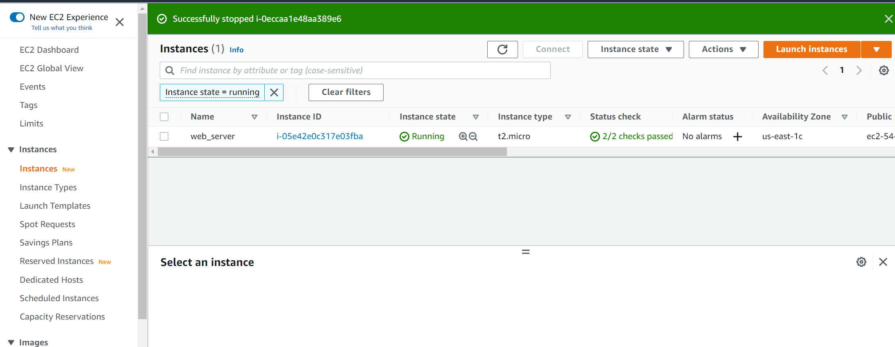
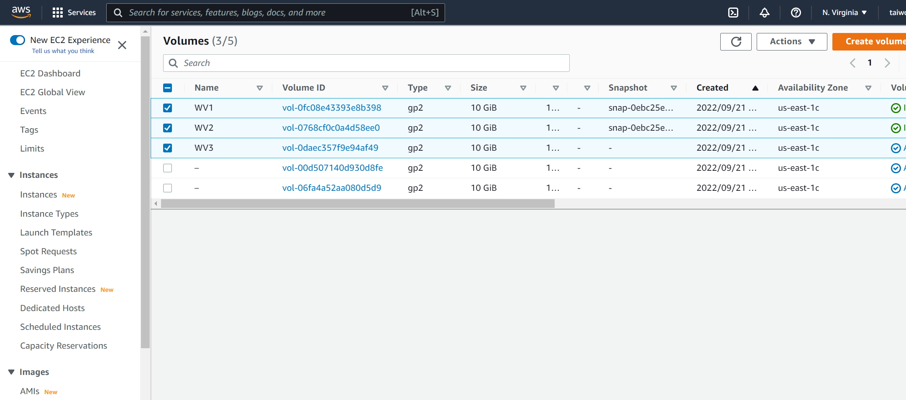
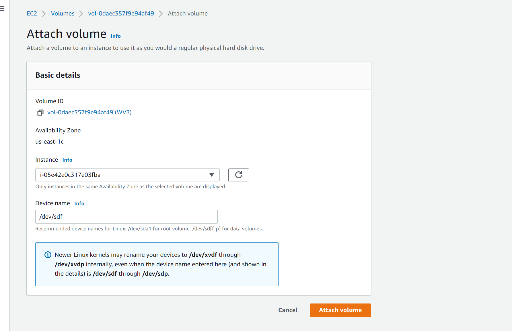

### Step 1 — Prepare a Web Server
1. Launch an EC2 instance that will serve as "Web Server

- Create 3 volumes in the same availability zone as your Web Server EC2, each of 10 GiB.

2. Attach all the three volumes to the Web Server EC2 instance

3. Open up the Linux terminal to begin configuration. We use the following command to verify the volumes attached to the instance `lsblk`