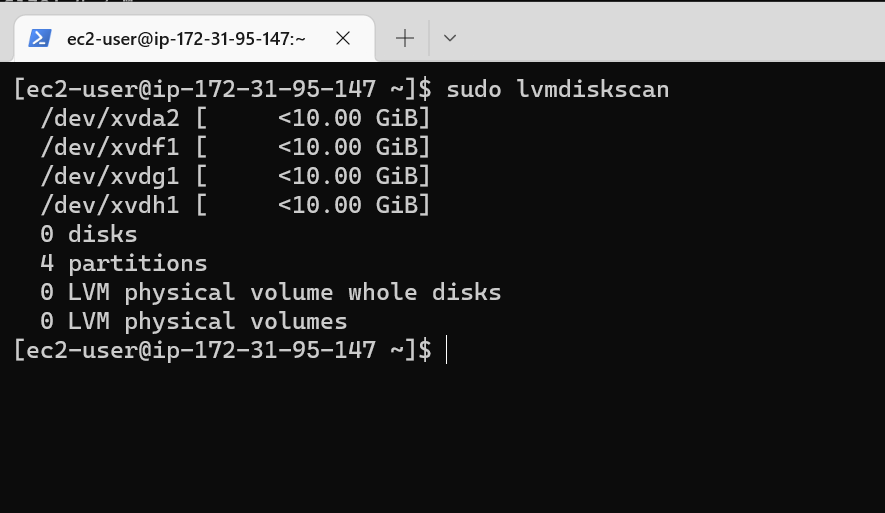
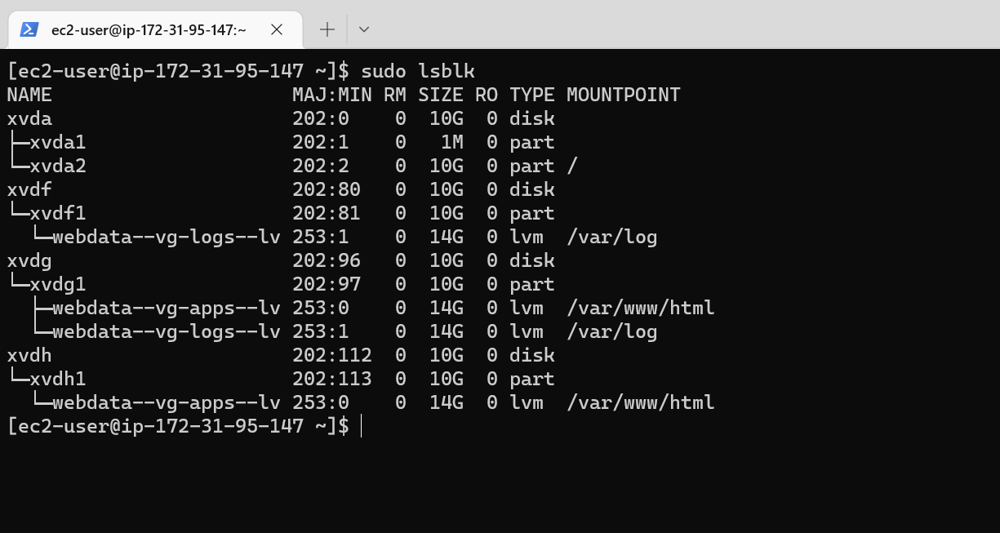
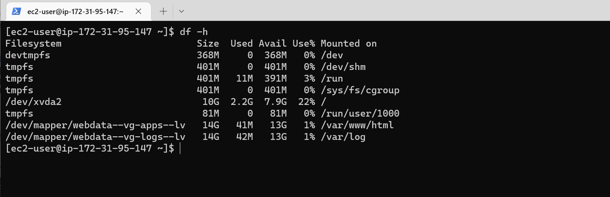
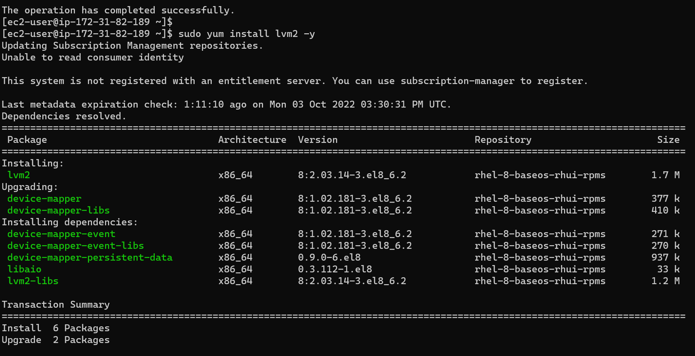
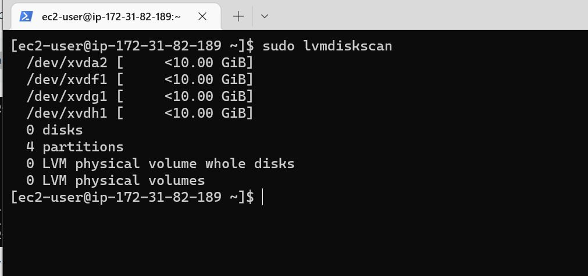

### Step 1 — Prepare a Web Server
1. Launch an EC2 instance that will serve as "Web Server

- Create 3 volumes in the same availability zone as your Web Server EC2, each of 10 GiB.

2. Attach all the three volumes to the Web Server EC2 instance

3. Open up the Linux terminal to begin configuration. We use the following command to verify the volumes attached to the instance `lsblk`

 - To see all the block devices in xvd `ls /dev | grep xvd`

4. Use df -h command to see all mounts and free space on your server `df -h` xvda2 is the only partition disk showing in the output and this is because it was automatically created when creating the instance

5. Let's use gdisk utility to create a single partition on each of the 3 disks
- gdisk partition for xvdg
`sudo gdisk /dev/xvdg`

- gdisk partition for xvdf
`sudo gdisk /dev/xvdf`

- gdisk partition for xvdh
`sudo gdisk /dev/xvdh`

5. Verfiy the partitions are configured as required on each of the 3 disks.
`lsblk`

6. To check for available partitions, Install lvm2 package using sudo yum install lvm2 (Linux Volume Manager) - which is a is a device mapper framework that provides logical volume management for the Linux kernel.
`sudo yum install lvm2`

- To check for available partitions, run `sudo lvmdiskscan`

7. Prepare the disks - Use pvcreate utility to mark each of 3 disks as physical volumes (PVs) to be used by LVM.
`sudo pvcreate /dev/xvdf1`
`sudo pvcreate /dev/xvdg1`
`sudo pvcreate /dev/xvdh1`

8. To Verify that Physical volume has been created successfully 
`sudo pvs`

9. Use vgcreate utility to add all 3 PVs to a volume group (VG). Name the VG webdata-vg
`sudo vgcreate webdata-vg /dev/xvdh1 /dev/xvdg1 /dev/xvdf1`
10. To verify it has been created
`sudo vgs`

11. Use lvcreate utility to create 2 logical volumes apps-lv and logs-lv. apps-lv will be used to store data for the Website and logs-lv will be used to store data for logs.
`sudo lvcreate -n apps-lv -L 14G webdata-vg`
`sudo lvcreate -n logs-lv -L 14G webdata-vg`

12. To verify that Logical Volume has been created successfully
`sudo lvs`

13. To verify the entire setup
`sudo vgdisplay -v`
`sudo lsblk`

14. Use mkfs.ext4 to format the logical volumes with ext4 filesystem
`sudo mkfs -t ext4 /dev/webdata-vg/apps-lv`
`sudo mkfs -t ext4 /dev/webdata-vg/logs-lv`

15. Create /var/www/html directory to store website files
`sudo mkdir -p /var/www/html`
16. Create /home/recovery/logs to store backup of log data
`sudo mkdir -p /home/recovery/logs`

17. Mount /var/www/html on apps-lv logical volume
`sudo mount /dev/webdata-vg/apps-lv /var/www/html/`
18. Use rsync utility to backup all the files in the log directory /var/log into /home/recovery/logs (This is required before mounting the file system)
`sudo rsync -av /var/log/. /home/recovery/logs/`

19. Mount /var/log on logs-lv logical volume
`sudo mount /dev/webdata-vg/logs-lv /var/log`
20. Restore log files back into /var/log directory.
`sudo rsync -av /home/recovery/logs/. /var/log`
21. Verify mount
`sudo lsblk`

### Update UUID
Update /etc/fstab file so that the mount configuration will persist after restart of the server. Check the UUID
`sudo blkid`

Edit the /etc/fstab/ by updating the UUID with the above.
`sudo vi /etc/fstab/`

1. Test the configuration and reload the daemon
`sudo mount -a`
 `sudo systemctl daemon-reload`
 
 2. Verify your setup by running df -h
 `df -h`
 
 ### Prepare the Database Server
 Launch an EC2 instance that will serve as "Database Server"
 

The 3 volumes in the same availability zone as Database Server EC2, each of 10 GiB have been attached 

Verify volumn creation and attachment.
`lsblk`

Create single partitions on all the 3 volumes using the gdisk utility.
`sudo gdisk /dev/xvdf`

`sudo gdisk /dev/xvdg`

`sudo gdisk /dev/xvdh`

Install lvm2 package
`sudo yum install lvm2 -y`

Run sudo lvmdiskscan command to check for available partitions.
`sudo lvmdiskscan`

Prepare the disks - Use pvcreate utility to mark each of 3 disks as physical volumes (PVs) to be used by LVM.
`sudo pvcreate /dev/xvdf1`
`sudo pvcreate /dev/xvdg1`
`sudo pvcreate /dev/xvdh1` 
 

 Verify that your Physical volume has been created successfully by running sudo pvs
 `sudo pvs`
 

 Use vgcreate utility to add all 3 PVs to a volume group (VG). Name the VG database-vg
`sudo vgcreate database-vg /dev/xvdh1 /dev/xvdg1 /dev/xvdf1`

Verify that your Vitural Group has been created successfully by running sudo vgs.
`sudo vgs`

Use lvcreate utility to create 2 logical volumes.
`sudo lvcreate -n db-lv -L 14G webdata-vg`
`sudo lvcreate -n logs-lv -L 14G webdata-vg`

To verify
`sudo lvs`

Verify the entire setup
`sudo vgdisplay -v `

Use mkfs.ext4 to format the logical volumes with ext4 filesystem
`sudo mkfs -t ext4 /dev/webdata-vg/db-lv`
`sudo mkfs -t ext4 /dev/webdata-vg/logs-lv`

Create /db directory to store database files and create /home/recovery/logs to store backup of log data.
`sudo mkdir -p /db`
`sudo mkdir -p /home/recovery/logs`

Mount db-lv logical volume
`sudo mount /dev/database-vg/db-lv /db`

Use rsync utility to backup all the files in the log directory /var/log into /home/recovery/logs
`sudo rsync -av /var/log/. /home/recovery/logs/`

Mount /var/log on logs-lv logical volume.
`sudo mount /dev/database-vg/logs-lv /var/log`

Restore
`sudo rsync -av /home/recovery/logs/. /var/log`

verify
`lsblk`

Update UUID in /etc/fstab. View UUID
`sudo blkid`

sudo vi /etc/fstab

Test the configuration and reload the daemon and verify your setup by running df -h
`df -h`

###  Install WordPress on your Web Server EC2
1. Update the repository
`sudo yum -y update`

2. Install wget, Apache and it’s dependencies
`sudo yum -y install wget httpd php php-mysqlnd php-fpm php-json`

3. Start Apache
`sudo systemctl enable httpd`
`sudo systemctl start httpd`

4. To install PHP and it’s depemdencies
`sudo yum install https://dl.fedoraproject.org/pub/epel/epel-release-latest-8.noarch.rpm`
`sudo yum install yum-utils http://rpms.remirepo.net/enterprise/remi-release-8.rpm`
`sudo yum module list php`
`sudo yum module reset php`
`sudo yum module enable php:remi-7.4`
`sudo yum install php php-opcache php-gd php-curl php-mysqlnd`
`sudo systemctl start php-fpm`
`sudo systemctl enable php-fpm`
`setsebool -P httpd_execmem 1`

5. Restart Apache
`sudo systemctl restart httpd`
6. Download wordpress and copy wordpress to var/www/html
`mkdir wordpress`
  `cd   wordpress`
  `sudo wget http://wordpress.org/latest.tar.gz`
  `sudo tar xzvf latest.tar.gz`
  `sudo rm -rf latest.tar.gz`
  `sudo cp -R wordpress /var/www/html/`
  `sudo cp wordpress/wp-config-sample.php wordpress/wp-config.php`
  
  7. Configure SELinux Policies
  `sudo chown -R apache:apache /var/www/html/wordpress`
  `sudo chcon -t httpd_sys_rw_content_t /var/www/html/wordpress -R`
  `sudo setsebool -P httpd_can_network_connect=1`
  

  ### Install MySQL on your DB Server EC2
  `sudo yum update`
  
`sudo yum install mysql-server`

Verify that the service is up and running by using sudo systemctl status mysqld, if it is not running, restart the service and enable it so it will be running even after reboot:
`sudo systemctl restart mysqld`
`sudo systemctl enable mysqld`
To check the status
`sudo systemctl status mysqld`

Configure DB to work with WordPress.
`sudo mysql`
`create database wordpress;`
`CREATE USER `myuser`@`<Web-Server-Private-IP-Address>` IDENTIFIED BY 'mypass';`
`GRANT ALL ON wordpress.* TO 'myuser'@'<Web-Server-Private-IP-Address>';`
`FLUSH PRIVILEGES;`
`SHOW DATABASES;`
`exit`

### Configure WordPress to connect to remote database
Open MySQL port 3306 on DB Server EC2. For extra security, you shall allow access to the DB server ONLY from your Web Server’s IP address,

1. Install MySQL client on the web server and test that you can connect from your Web Server to your DB server by using mysql-client.
`sudo yum install mysql -y`
`sudo mysql -u myuser -p -h 172.31.82.189`

2. Verify if you can successfully execute SHOW DATABASES; command and see a list of existing databases.
`SHOW DATABASES;`

3. Change permissions and configuration so Apache could use WordPress:

4. Enable TCP port 80 in Inbound Rules configuration for the Web Server EC2

5. Try to access the wordpress in the browser using the web server public address
http://3.89.218.222/wordpress/

